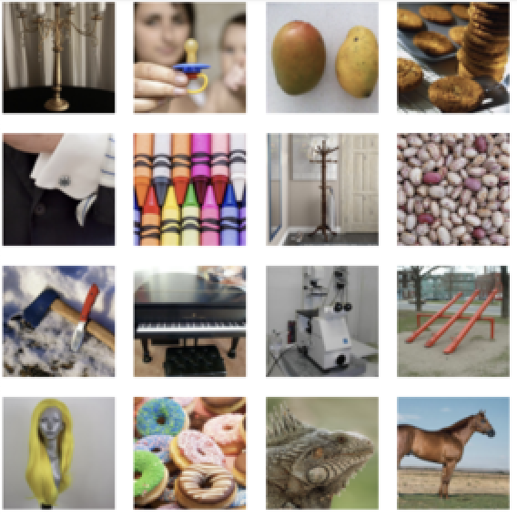
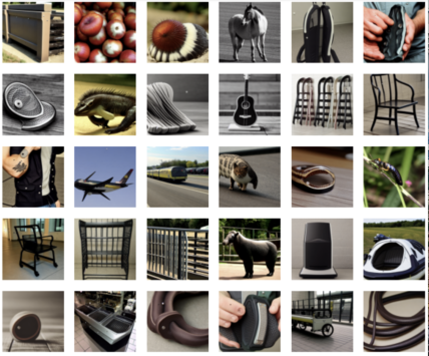
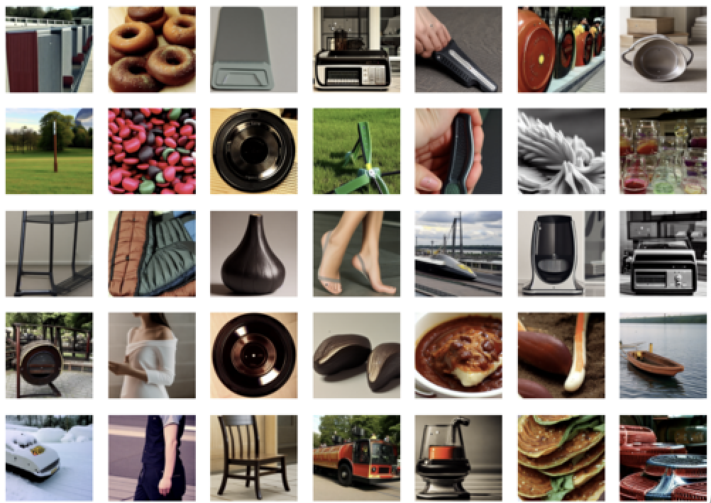
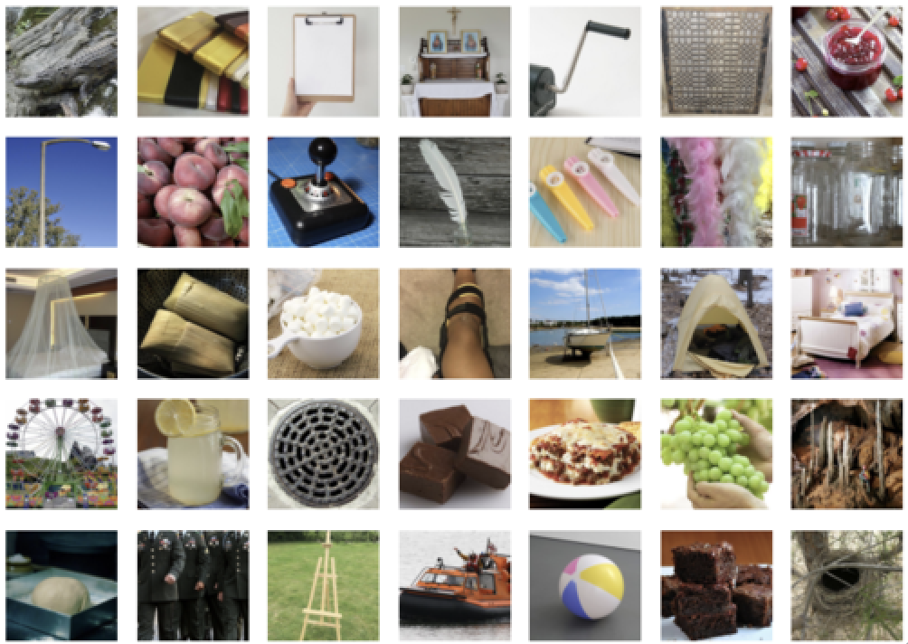
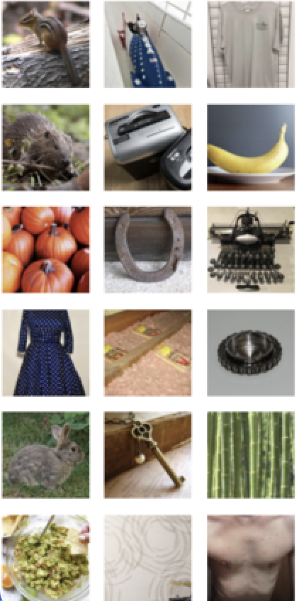

# Things Brain Project Results
## UCSB Dynamo Undergrads

Our project was to generate images from a subject’s fMRI that corresponded with the image the subject was viewing when the fMRI was taken. We used the THINGS dataset for this project.

The architectures we used were LDMs, MLPs, and convulational auto-encoders.

This repo contains two images. One image contains reconstructions made from fMRI scans; call this image RI. The other contains the ground truth image; call this image GTI. Note that index RI_ij corresponds with index GTI_ij. That is, the reconstructed image found in image RI at index ij corresponds to the reconstruction of the image in GTI at index ij.

### Pair 1

  

    

      <strong>RI 1</strong> 
      
    

    

      <strong>GTI 1</strong> 
      
    

  

### Pair 2

  

    

      <strong>RI 2</strong> 
      
    

    

      <strong>GTI 2</strong> 
      
    

  

### Pair 3

  

    

      <strong>RI 3</strong> 
      
    

    

      <strong>GTI 3</strong> 
      
    

  

### Pair 4

  

    

      <strong>RI 4</strong> 
      
    

    

      <strong>GTI 4</strong> 
      
    

  

